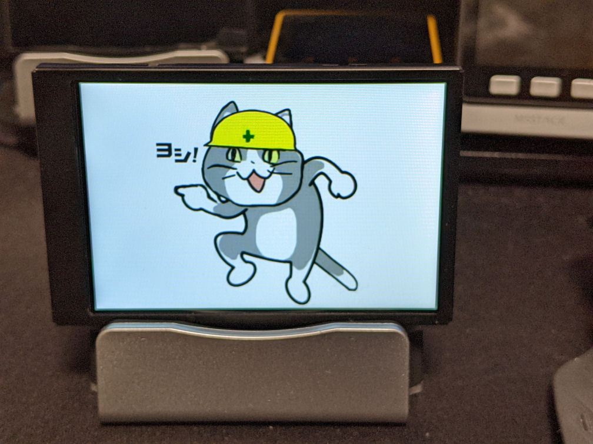

# TuringSmartScreenLib

| Package | Info | Description |
|-|-|-|
| TuringSmartScreenLib | [](https://www.nuget.org/packages/TuringSmartScreenLib/) | Core |
| TuringSmartScreenLib.Helpers.SkiaSharp | [](https://www.nuget.org/packages/TuringSmartScreenLib.Helpers.SkiaSharp/) | Helpers |

## What is this?

* Turing Smart Screen controller library.

## Usage

```csharp
using SkiaSharp;

using TuringSmartScreenLib;
using TuringSmartScreenLib.Helpers.SkiaSharp;

using var screen = ScreenFactory.Create(ScreenType.RevisionB, "COM10");
screen.SetBrightness(100);
screen.Orientation = ScreenOrientation.Landscape;

using var bitmap = SKBitmap.Decode(File.OpenRead("genbaneko.png"));
var buffer = screen.CreateBufferFrom(bitmap);

screen.DisplayBuffer(0, 0, buffer);
```



# TuringSmartScreenTool

CLI for turing smart screen.

## Install

```
> dotnet tool install -g TuringSmartScreenTool
```

## Usage

```
> tsstool reset -r a -p COM10
> tsstool clear -r a -p COM10
> tsstool on -p COM10
> tsstool off -p COM10
> tsstool bright -p COM10 -l 192
> tsstool image -p COM10 -f genbaneko.png
> tsstool fill -p COM10 -c ff0000
> tsstool text -p COM10 -t TEST -x 80 -y 40 -s 96 -f Arial -c ff0000 -b 0000ff
```
