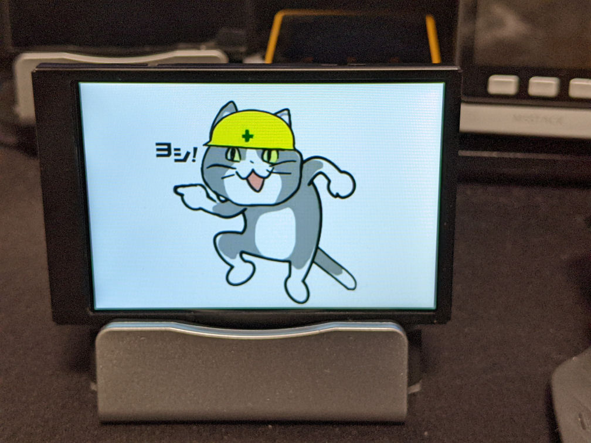
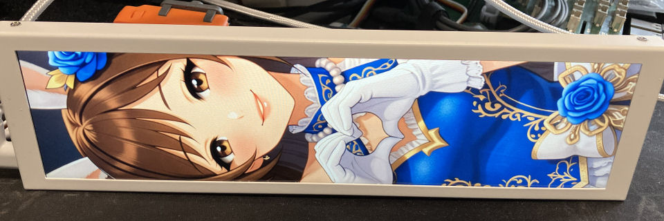

# LCD Driver Library

| Package | Info | Description |
|-|-|-|
| TuringSmartScreenLib | [](https://www.nuget.org/packages/TuringSmartScreenLib/) | Core |
| TuringSmartScreenLib.Helpers.SkiaSharp | [](https://www.nuget.org/packages/TuringSmartScreenLib.Helpers.SkiaSharp/) | Helpers |
| LcdDriver.TrofeoVision | [](https://www.nuget.org/packages/LcdDriver.TrofeoVision/) | Thermalright Trofeo Vision usb lcd controller |
| LcdDriver.TuringSmartScreen | [](https://www.nuget.org/packages/LcdDriver.TuringSmartScreen/) | Turing-Smart-Screen usb lcd controller |

## 👉What is this?

LCD controller libraries for the following devices:

* [Turing Smart Screen](https://www.turzx.com/) 3.5 inch / 5 inch / 8 inch (Serial)
* [Turing Smart Screen](https://www.turzx.com/) 8 inch USB Revision 1.1 (USB)
* [Thermalright Trofeo Vision](https://www.thermalright.com/product/trofeo-vision-lcd-white/) (USB HID)

## 🔲TuringSmartScreenLib

Turing Smart Screen 3.5 inch, 5 inch, 8 inch serial connection models.

| Revision | Screen Size | Resolution |
|-|-|-|
| RevisionA | 3.5 inch | 320x480 |
| RevisionB | 3.5 inch | 320x480 |
| RevisionC | 5 inch | 800x480 |
| RevisionE | 8 inch | 480x1920 |



### 🧩Usage

```csharp
using SkiaSharp;

using TuringSmartScreenLib;
using TuringSmartScreenLib.Helpers.SkiaSharp;

using var screen = ScreenFactory.Create(ScreenType.RevisionB, "COM10");
screen.SetBrightness(100);
screen.Orientation = ScreenOrientation.Landscape;

using var bitmap = SKBitmap.Decode(File.OpenRead("genbaneko.png"));
var buffer = screen.CreateBufferFrom(bitmap);

screen.DisplayBuffer(0, 0, buffer);
```

## 🔲LcdDriver.TrofeoVision

Thermalright Trofeo Vision USB HID LCD controller (1280x480).

| Item | Value |
|-|-|
| Connection | USB HID |
| Resolution | 1280x480 |
| VID / PID | 0x0416 / 0x5302 |


### 🧩Usage

```csharp
using HidSharp;
using LcdDriver.TrofeoVision;

var device = DeviceList.Local
    .GetHidDevices(ScreenDevice.VendorId, ScreenDevice.ProductId)
    .FirstOrDefault();

using var screen = new ScreenDevice(device);

var jpegBytes = await File.ReadAllBytesAsync("image-1280x480.jpg");
screen.DrawJpeg(jpegBytes);
```

### 🌐Link

- [MacStatDisplay](https://github.com/usausa/mac-stat-display) : macOS system monitor

## 🔲LcdDriver.TuringSmartScreen

Turing Smart Screen 8 inch USB Revision 1.1 LCD controller.

| Item | Value |
|-|-|
| Connection | USB |
| Resolution | 480x1920 |
| VID / PID | 0x1CBE / 0x0088 |



### 🧩Usage

```csharp
using LibUsbDotNet;
using LibUsbDotNet.Main;
using LcdDriver.TuringSmartScreen;

var finder = new UsbDeviceFinder(0x1CBE, 0x0088);
using var device = UsbDevice.OpenUsbDevice(finder);

using var screen = new ScreenDevice(device);
screen.Sync();
screen.SetOrientation(ScreenOrientation.Portrait);
screen.SetBrightness(100);

var jpegBytes = await File.ReadAllBytesAsync("image-480x1920.jpg");
screen.DrawJpeg(jpegBytes);

UsbDevice.Exit();
```

## 🛠️TuringSmartScreenTool

CLI for turing smart screen.

### 📦Install

```
> dotnet tool install -g TuringSmartScreenTool
```

### 📘Usage

```
> tsstool reset -r a -p COM10
> tsstool clear -r a -p COM10
> tsstool on -p COM10
> tsstool off -p COM10
> tsstool bright -p COM10 -l 192
> tsstool image -p COM10 -f genbaneko.png
> tsstool fill -p COM10 -c ff0000
> tsstool text -p COM10 -t TEST -x 80 -y 40 -s 96 -f Arial -c ff0000 -b 0000ff
```
