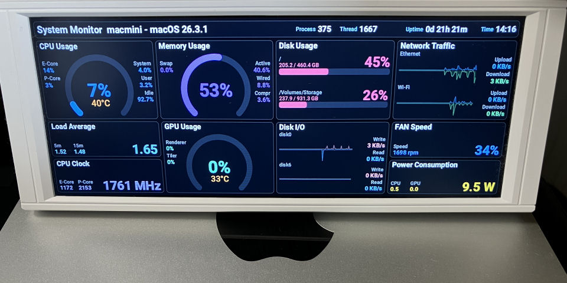
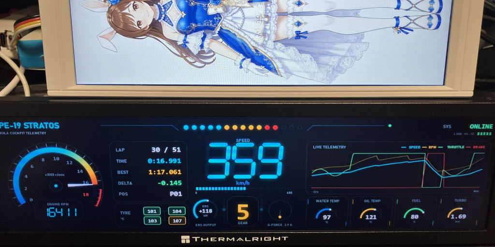
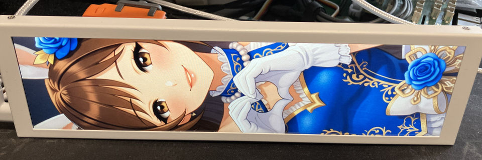
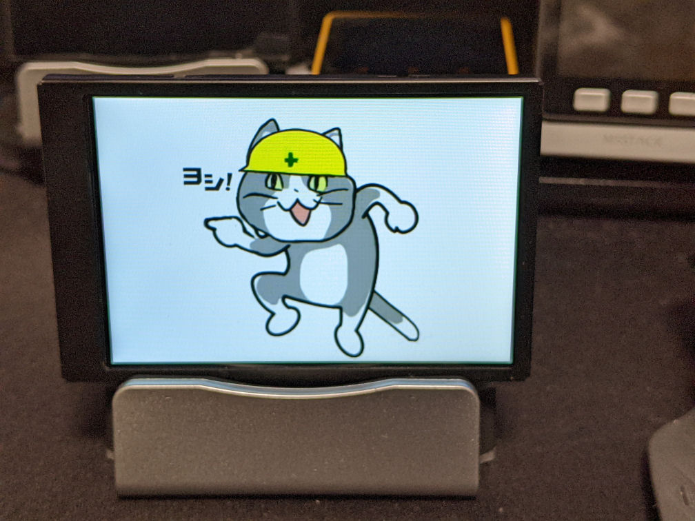

# LCD Driver Library

| Package | Info | Description |
|-|-|-|
| TuringSmartScreenLib | [](https://www.nuget.org/packages/TuringSmartScreenLib/) | Core |
| TuringSmartScreenLib.Helpers.SkiaSharp | [](https://www.nuget.org/packages/TuringSmartScreenLib.Helpers.SkiaSharp/) | Helpers |
| TuringSmartScreenLib.Helpers.GdiPlus | [](https://www.nuget.org/packages/TuringSmartScreenLib.Helpers.GdiPlus/) | Helpers (GDI+, Windows) |
| LcdDriver.TuringSmartScreen | [](https://www.nuget.org/packages/LcdDriver.TuringSmartScreen/) | Turing-Smart-Screen usb lcd controller |
| LcdDriver.TrofeoVision | [](https://www.nuget.org/packages/LcdDriver.TrofeoVision/) | Thermalright Trofeo Vision usb lcd controller |
| LcdDriver.TrofeoVisionLy | [](https://www.nuget.org/packages/LcdDriver.TrofeoVisionLy/) | Thermalright Trofeo Vision 9.16 / 11.3 usb lcd controller |

## 👉What is this?

LCD controller libraries for the following devices:

* [Turing Smart Screen](https://www.turzx.com/) 3.5 inch / 5 inch / 8 inch (Serial)
* [Turing Smart Screen](https://www.turzx.com/) USB models (USB)
* [Thermalright Trofeo Vision](https://www.thermalright.com/product/trofeo-vision-lcd-white/) (USB HID)
* [Thermalright Trofeo Vision 9.16 / 11.3](https://www.thermalright.com/product/trofeo-vision-9-16-lcd-black/) (USB)

## ⚙️Prerequisites

`LcdDriver.TuringSmartScreen` and `LcdDriver.TrofeoVisionLy` require the [libusb-1.0](https://libusb.info/) native library at runtime.  
It must be installed separately for each platform.

| OS | How to install |
|-|-|
| Windows | Download `libusb-1.0.xx.7z` from [libusb releases](https://github.com/libusb/libusb/releases), then place `VS2022\MS64\dll\libusb-1.0.dll` in the same directory as the executable. |
| Ubuntu / Debian | `sudo apt install libusb-1.0-0` |
| Fedora / RHEL | `sudo dnf install libusb1` |
| macOS | `brew install libusb` |

## 🔲LcdDriver.TrofeoVision

Thermalright Trofeo Vision USB HID LCD controller.

| Model | Screen Size | Resolution | VID / PID | Status |
|-|-|-|-|-|
| [Trofeo Vision LCD](https://www.thermalright.com/product/trofeo-vision-lcd-white/) | 6.86 inch | 1280x480 | 0x0416 / 0x5302 | ✅ |



### 🧩Usage

```csharp
using HidSharp;
using LcdDriver.TrofeoVision;

var device = DeviceList.Local
    .GetHidDevices(UsbIds.VendorId, UsbIds.ProductId)
    .FirstOrDefault();

using var screen = new ScreenDevice(device);
var info = screen.Handshake();

var jpegBytes = await File.ReadAllBytesAsync("image-1280x480.jpg");
screen.DrawJpeg(jpegBytes);
```

### 🌐Link

- [MacStatDisplay](https://github.com/usausa/mac-stat-display) : macOS system monitor

## 🔲LcdDriver.TrofeoVisionLy

Thermalright Trofeo Vision 9.16 / 11.3 USB LCD controller.

| Model | Screen Size | Resolution | VID / PID | Status |
|-|-|-|-|-|
| [Trofeo Vision 9.16 LCD](https://www.thermalright.com/product/trofeo-vision-9-16-lcd-black/) | 9.16 inch | 1920x480 | 0x0416 / 0x5408 | ✅ |
| [Trofeo Vision 9.16 ARGB LCD](https://www.thermalright.com/product/trofeo-vision-9-16-argb-lcd-black/) | 9.16 inch | 1920x480 | 0x0416 / 0x5408 | ❔ |
| [Trofeo Vision 11.3 LCD](https://www.thermalright.com/product/trofeo-vision-11-3-lcd-black/) | 11.3 inch | 1920x400 | 0x0416 / 0x5408 | ❔ |



### 🧩Usage

```csharp
using LibUsbDotNet.LibUsb;
using LibUsbDotNet.Main;
using LcdDriver.TrofeoVisionLy;

using var usbContext = new UsbContext();
var finder = new UsbDeviceFinder { Vid = UsbIds.VendorId, Pid = UsbIds.ProductId };
using var device = usbContext.Find(finder) as UsbDevice;
device?.Open();

using var screen = new ScreenDevice(device);
var info = screen.Handshake();

var jpegBytes = await File.ReadAllBytesAsync("image-1920x480.jpg");
screen.DrawJpeg(jpegBytes);
```

## 🔲LcdDriver.TuringSmartScreen

Turing Smart Screen USB LCD controller.

| Model | Screen Size | Resolution | VID / PID | Status |
|-|-|-|-|-|
| Turing Smart Screen 2.8 (round) | 2.8 inch | 480x480 | 0x1CBE / 0x0028 | ❔ |
| Turing Smart Screen 4.6 | 4.6 inch | 320x960 | 0x1CBE / 0x0046 | ❔ |
| Turing Smart Screen 5.2 | 5.2 inch | 720x1280 | 0x1CBE / 0x0050 | ❔ |
| Turing Smart Screen 8.0 | 8.0 inch | 800x1280 | 0x1CBE / 0x0080 | ❔ |
| Turing Smart Screen 8.8 (Revision 1.1) | 8.8 inch | 480x1920 | 0x1CBE / 0x0088 | ✅ |
| Turing Smart Screen 9.2 | 9.2 inch | 462x1920 | 0x1CBE / 0x0092 | ❔ |
| Turing Smart Screen 12.3 | 12.3 inch | 720x1920 | 0x1CBE / 0x0123 | ❔ |



### 🧩Usage

```csharp
using LibUsbDotNet.LibUsb;
using LibUsbDotNet.Main;
using LcdDriver.TuringSmartScreen;

using var usbContext = new UsbContext();
var finder = new UsbDeviceFinder { Vid = UsbIds.VendorId, Pid = UsbIds.ProductId88 };
using var device = usbContext.Find(finder) as UsbDevice;
device?.Open();

using var screen = new ScreenDevice(device);
screen.Sync();
screen.SetOrientation(ScreenOrientation.Portrait);
screen.SetBrightness(100);

var jpegBytes = await File.ReadAllBytesAsync("image-480x1920.jpg");
screen.DrawJpeg(jpegBytes);
```

## 🔲TuringSmartScreenLib

Turing Smart Screen 3.5 inch, 5 inch, 8 inch serial connection models.

| Revision | Screen Size | Resolution |
|-|-|-|
| RevisionA | 3.5 inch | 320x480 |
| RevisionB | 3.5 inch | 320x480 |
| RevisionC | 5 inch | 800x480 |
| RevisionE | 8 inch | 480x1920 |



### 🧩Usage

```csharp
using SkiaSharp;

using TuringSmartScreenLib;
using TuringSmartScreenLib.Helpers.SkiaSharp;

using var screen = ScreenFactory.Create(ScreenType.RevisionB, "COM10");
screen.SetBrightness(100);
screen.Orientation = ScreenOrientation.Landscape;

using var bitmap = SKBitmap.Decode(File.OpenRead("genbaneko.png"));
var buffer = screen.CreateBufferFrom(bitmap);

screen.DisplayBuffer(0, 0, buffer);
```

## 🛠️TuringSmartScreenTool

CLI for turing smart screen.

### 📦Install

```
> dotnet tool install -g TuringSmartScreenTool
```

### 📘Usage

```
> tsstool reset -r a -p COM10
> tsstool clear -r a -p COM10
> tsstool on -p COM10
> tsstool off -p COM10
> tsstool bright -p COM10 -l 192
> tsstool image -p COM10 -f genbaneko.png
> tsstool fill -p COM10 -c ff0000
> tsstool text -p COM10 -t TEST -x 80 -y 40 -s 96 -f Arial -c ff0000 -b 0000ff
```
